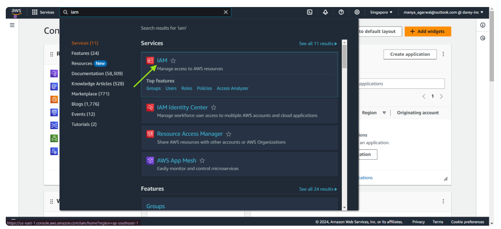

# AWS Identity and Access Management Mini Project

## Project Goals
- Understanding AWS Identity and Access Managemnt (IAAM) Principles
- Learning to create IAAM Policies for regulating Access

## Learning Outcome:
- dsvjbsdfjkvbfjbnvkfdnvfdkvjkvd
- sjkdavndvkladsnvkdvndsvjkvs

## Steps in creating IAAM in AWS
1. Navigate to AWS management Console
user the search bar to search for IAAM

## Steps in creating IAAM in AWS
1. Navigate to AWS management Console
user the search bar to search for IAAM

